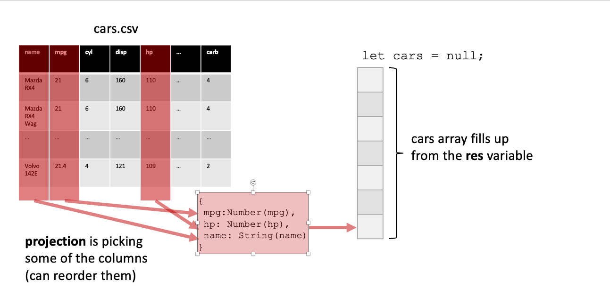

#### <u> Interactive Data Visualization </u>

#### (c) 2025 Timothy James Becker

This open educational resource (OER) is intended as the basis for an undergraduate course (14 week) where the students have already been exposed to at least one semester of a high-level programming language such as [Python](https://www.python.org/).  The intended student does not have to be familiar with web programming standards: [HTML]( https://developer.mozilla.org/en-US/docs/Web/HTML), [CSS]( https://developer.mozilla.org/en-US/docs/Web/CSS) and [JavaScript]( https://developer.mozilla.org/en-US/docs/Web/JavaScript) since we review those aspects initially.  We present the material as a series of [jupyter notebooks](https://jupyter.org/) intended to be run by the student using a standard python3 kernel attached to a scientific python distribution such as [Anaconda](https://www.anaconda.com/download/success). These notebooks contain cells which are markup (which is compatible with HTML5) or code (in one of the supported programming languages such as python). When hosted on a platform like google collaborate, they allow the user to view the text, click on [hyperlinks](https://en.wikipedia.org/wiki/Hyperlink) and also run some of the python code examples that illustrate the visualization and machine learning methods.  If using a platform such as [GitHub](https://docs.github.com/en/pages), the rendered jupyter notebooks will not have a running kernel attached and will therefore not execute python code.  The foundational components for practice will be client-side web applications consisting of a folder which HTML, CSS, JS and data files inside (such as [CSV](https://en.wikipedia.org/wiki/Comma-separated_values) and [JSON](https://developer.mozilla.org/en-US/docs/Web/JavaScript/Reference/Global_Objects/JSON) formats).  We include appendix sections that have some details in [setting up a development environment]() and for [hosting a finished visualization on github.io]().

We start the course with a visualization and interaction overview which is intended to facilitate exploration and communication of complex data.  This is followed by a primer on web programming which details the [DOM](https://developer.mozilla.org/en-US/docs/Web/API/Document_Object_Model), some background on styling with respect to visual components and finally data-centric programming patterns and exercises that are useful for working with data using JavaScript.  Because we are interested in learning about data in this course, we discuss data cleaning (mining and preprocessing) and machine learning (imputation and clustering) methods using the python programming language (which is more robust and simpler for these tasks).  We spend time to discuss and explore the color and composition elements of perceptual theory which will allow the student to better conceptualize why certain visual methods better communicate certain types of data to the audience.  This is followed by a section on spatial visualization (maps and Geographic information) and some coverage of clustering and dimension reduction methods.

Visualization in this course is the process of taking data (in a simple table or more complex structure) and constructing a mapping of one or more columns (or fields or variables) to a visualization scale such as a position axis, color gradient, geometric parameter (like size or circle radius).

#### Python Requirements
python 3.10+ (use anaconda distribution on non-Debian Linux platforms)

jupyterlab 4.0.11

numpy 1.26.4

scipy 1.13.1

scikit-learn 1.4.2

umap-learn 0.5.8

matplotlib 3.8.4 

#### Javascript Libraries
d3.js (v7)

leaflet.js (v1.9.4)

 

#### Visual Preview of Figures:

 

 

 

 

 

 

 

 

 

 

 

 

 

 

 